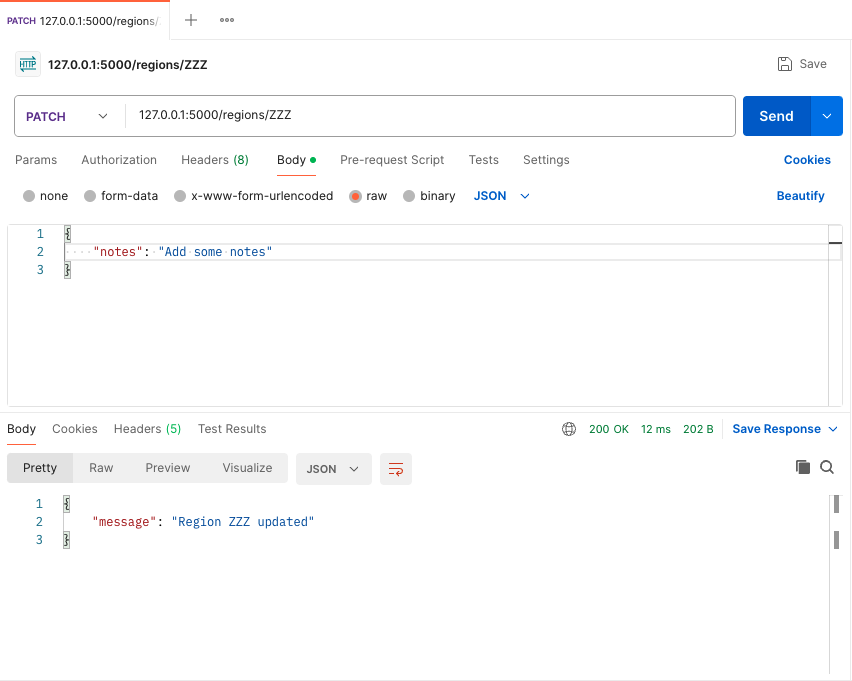

# PUT and PATCH routes

This file attempts to clarify the difference.

REST is a set of 'rules' as to how an API should behave.

The 'rules' for PUT and PATCH are:

- PUT: 
  - Used to update a resource or create a new resource if it does not exist.
  - The entire resource is replaced with the new data. 
  - If the resource does not exist, it will be created.
- PATCH: 
  - Used to partially update a resource. 
  - Useful when you want to update only a few fields of a resource without replacing the entire resource. 
  - Specify the fields that need to be updated in the request body.

Flask receives the HTTP method in the request. There is nothing I found in the Flask documentation to suggest that the method applies any logic to the request.

How your app handles the request is therefore up to you to implement it the logic.

Here is an alternative for the update_region():

```python
@app.route("/regions/<noc_code>", methods=['PUT', 'PATCH'])
def region_update(noc_code):
    """

    Updates changed fields for the region in accordance with the method received.

    PUT:
        - Used to update a resource or create a new resource if it does not exist.
        - The entire resource is replaced with the new data.
        - If the resource does not exist, it will be created.
    PATCH:
        - Used to partially update a resource.
        - Useful when you want to update only a few fields of a resource without replacing the entire resource.
        - Specify the fields that need to be updated in the request body.

    """

    # Find the region in the database
    existing_region = db.session.execute(
        db.select(Region).filter_by(NOC=noc_code)
    ).scalar_one_or_none()

    # Get the updated details from the json sent in the HTTP patch request
    region_json = request.get_json()

    # Use Marshmallow to update the existing records with the changes from the json
    if request.method == 'PATCH':
        # partial=True allows updates of just some fields
        r = region_schema.load(region_json, instance=existing_region, partial=True)
    if request.method == 'PUT':
        try:
            # allows updates only if all required fields are provided
            r = region_schema.load(region_json, instance=existing_region)
        except ValidationError as err:
            return err.messages, 400

    # Commit the changes to the database
    db.session.add(r)
    db.session.commit()

    return {"message": f"Region {noc_code} updated"}
```

If you then use a tool like postman to test a partial update, then trying a partial update with PUT now fails and PATCH works:



